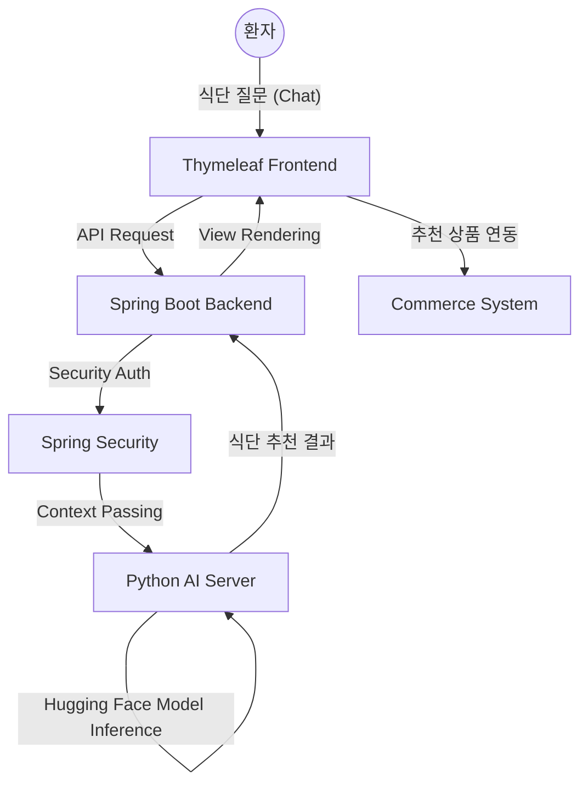

# 🏥 Dialysis Lounge: Hugging Face AI 식단 추천 및 의료 통합 플랫폼

> **"데이터 학습부터 서비스 통합까지, 환자를 위한 맞춤형 Warm Tech"**
>
> Dialysis Lounge는 투석 환자들의 엄격한 식이 관리를 돕기 위해 제작된 **AI 기반 헬스케어 솔루션**입니다. 
> **Hugging Face**를 통해 학습시킨 AI 식단 모델을 기반으로 프론트엔드와 백엔드를 유기적으로 연결하여, 환자에게 실시간으로 최적화된 식단 처방과 커머스 경험을 제공합니다.

 

## 🚀 Key Achievements (핵심 성과)
* **AI 모델 자체 학습**: Hugging Face의 Transformers 라이브러리를 활용하여 투석 환자 맞춤형 식단 추천 모델을 파인튜닝(Fine-tuning) 및 배포
* **Full-Stack Integration**: Thymeleaf 프론트엔드, Spring Boot 백엔드, Python AI 서버 간의 **End-to-End 인터페이스** 직접 구축
* **보안 및 인증 최적화**: Spring Security를 도입하여 환자의 건강 데이터와 개인정보를 안전하게 보호하는 보안 아키텍처 설계
* **커머스 서비스 통합**: AI가 추천한 식단에 맞는 특수 식품을 즉시 구매할 수 있는 **E-commerce 파이프라인** 구현

 

## 🛠 Tech Stack (기술 스택)

### AI & Data

### Backend & Security

### Frontend

 

## 🏗 System Architecture (시스템 구조)

🌟 Core Features (주요 기능)
1. Hugging Face 기반 AI 식단 챗봇
투석 환자의 건강 상태(체중, 혈압 등) 데이터를 기반으로 Hugging Face 모델이 개인별 맞춤 식단을 생성합니다.

프론트엔드와 실시간으로 통신하여 사용자 맞춤형 말투와 정보를 제공하는 챗봇 인터페이스를 구현했습니다.

2. 보안 인증 및 권한 관리 (Spring Security)
환자의 민감한 의료 데이터를 보호하기 위해 BCrypt 암호화와 권한 분기 처리를 적용했습니다.

일반 사용자(환자)와 관리자(ADMIN)의 대시보드를 분리하여 데이터 접근 권한을 엄격히 통제합니다.

3. 환자 전용 특수 식품 커머스
AI가 추천한 저나트륨/저칼륨 식단에 기반하여 관련 식품을 장바구니에 담고 주문할 수 있는 원스톱 결제 시스템을 구축했습니다.

상품 등록, 주문 내역 추적 등 이커머스의 핵심 비즈니스 로직을 JPA 엔티티로 설계했습니다.

🧠 Engineering Focus (엔지니어링 회고)
[Challenge] AI 모델과 웹 서비스의 완벽한 결합
단순히 AI 모델을 만드는 것에 그치지 않고, 이를 실제 웹 서비스 환경에서 구동하는 것에 집중했습니다. Hugging Face 모델의 추론 결과를 Spring Boot 백엔드로 전달하고, 이를 Thymeleaf를 통해 사용자에게 렌더링하는 전체 파이프라인을 구축하며 이기종 언어 간의 데이터 처리 역량을 길렀습니다.

[Solution] 사용자 경험(UX) 중심의 비동기 처리
AI 모델의 추론 속도로 인해 발생할 수 있는 대기 시간을 최소화하기 위해 프론트엔드와 백엔드 간의 효율적인 통신 구조를 설계했습니다. 또한, 보안과 성능 사이의 균형을 맞추기 위해 Spring Security의 필터 체인을 커스터마이징하여 인증 과정에서의 오버헤드를 최적화했습니다.
